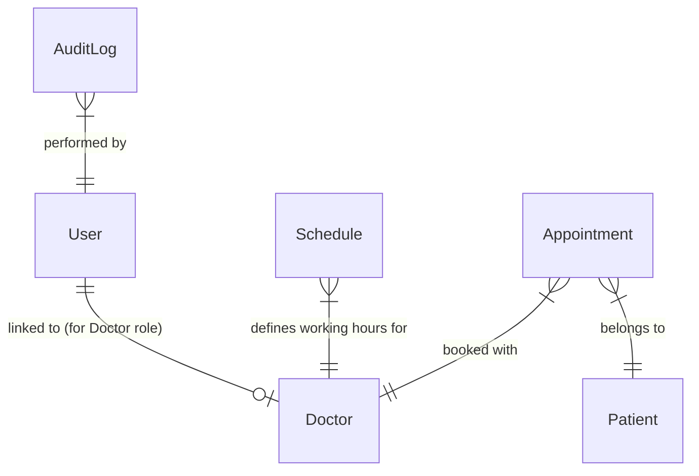

# Aura EMR - Enterprise Appointment Management System

A production-ready Enterprise EMR Appointment Management System built with the **MERN Stack** (Node.js, Express, MongoDB, React, Redux Toolkit, Socket.IO). 

The application is engineered with a secure Service-Layer architecture, database-level concurrency safeguards, dynamic slot generation matching doctor working sessions and breaks, and real-time interface sync via WebSockets.

---

## 🚀 Key Features

* **JWT Access & Refresh Token Rotation**: Implements secure session handshakes with invalidation on logout.
* **Role-Based Access Control (RBAC)**: Supports **Super Admin**, **Receptionist**, and **Doctor** roles with endpoint guardrails.
* **Dynamic Slot Generator**: Generates appointment slots based on working days, session timings, and duration, excluding lunch breaks.
* **Double Booking Prevention**: Uses a MongoDB Compound Partial Unique Index to ensure transactional integrity across distributed servers.
* **Real-time Synchronization**: Socket.IO synchronization keeps the receptionist slot grids and doctor consultation lists updated in real-time.
* **Advanced Ledger Filters**: Paginated, sorted, and filtered server-side logs supporting text and mobile searches.
* **Doctor Consultation Console**: Dedicated view for doctors to log prescription/clinical notes and complete sessions.

---

## 📁 Project Directory Structure

```
Aura-EMR/
│
├── backend/
│   ├── config/               # DB connections & Socket servers
│   ├── controllers/          # HTTP request handlers (lightweight)
│   ├── middlewares/          # JWT auth, RBAC checks, Joi validations, error logs
│   ├── models/               # Mongoose schemas & indexes
│   ├── routes/               # API endpoint routing
│   ├── services/             # Core business logic & database queries
│   ├── validators/           # Joi validation schemas
│   ├── utils/                # Loggers, AppError, time helpers
│   ├── scripts/              # Seeding & Concurrency test scripts
│   ├── .env                  # Environment configurations (ignored in Git)
│   └── package.json
│
├── frontend/
│   ├── src/
│   │   ├── components/       # Reusable UI & Dashboards (Admin, Receptionist, Doctor)
│   │   ├── pages/            # Login, Dashboard, Scheduler, Ledger
│   │   ├── store/            # Redux Toolkit store & slices
│   │   ├── utils/            # Axios API wrappers & socket connectors
│   │   ├── index.css         # Custom premium dark theme styling
│   │   └── main.jsx
│   ├── index.html
│   └── package.json
│
├── ENGINEERING_DECISIONS.md  # Detailed technical rationale
└── README.md                 # Project guide
```

---

## 📊 Database Design

Below is the entity-relationship model illustrating how the collections correlate:



### Collection Indexes & Optimizations
* **User**: Unique index on `email` to speed up authentication checks.
* **Patient**: Unique index on `mobileNumber` and index on `patientId` for fast lookup.
* **Appointment**: Compound partial unique index on `{ doctor: 1, date: 1, "slot.startTime": 1 }` filtered on active statuses (`scheduled`, `arrived`, `completed`) to prevent double bookings.

---

## ⚙️ Environment Variables

### Backend (`backend/.env`)
Create a `.env` file inside the `backend/` directory:
```env
PORT=5000
MONGODB_URI=mongodb://127.0.0.1:27017/emr_appointment_system
JWT_ACCESS_SECRET=your_jwt_access_secret_key
JWT_REFRESH_SECRET=your_jwt_refresh_secret_key
JWT_ACCESS_EXPIRY=15m
JWT_REFRESH_EXPIRY=7d
CORS_ORIGIN=http://localhost:5173
NODE_ENV=development
```

---

## 🔌 API Endpoints Documentation

### Authentication
* `POST /api/v1/auth/login` - Authenticates credentials; returns user, access token, and refresh token.
* `POST /api/v1/auth/refresh` - Obtains a new access token using a valid refresh token.
* `POST /api/v1/auth/logout` - (Protected) Invalidates the refresh token.

### Doctors & Schedules
* `GET /api/v1/doctors` - (Protected) Retrieves lists of all active doctor profiles.
* `GET /api/v1/doctors/:id/schedule` - (Protected) Retrieves the configured schedule for a doctor.
* `POST /api/v1/doctors` - (Super Admin) Registers a new doctor profile and user account.
* `POST /api/v1/doctors/receptionists` - (Super Admin) Registers a new receptionist user account.
* `POST /api/v1/doctors/:id/schedule` - (Super Admin) Configures working days, slot duration, sessions, and break times.

### Slots
* `GET /api/v1/slots` - (Protected) Generates available, booked, and past time slots for a doctor on a target date.

### Appointments
* `POST /api/v1/appointments` - (Receptionist/Admin) Books an appointment. Registers patient automatically if `isNewPatient` is true.
* `GET /api/v1/appointments` - (Protected) Paginated list of appointments with filters. Restricts doctors to their own list.
* `PUT /api/v1/appointments/:id` - (Staff) Updates appointment purpose, status, or clinical notes.
* `DELETE /api/v1/appointments/:id` - (Receptionist/Admin) Cancels appointment.
* `POST /api/v1/appointments/:id/arrive` - (Receptionist/Admin) Marks patient status as `arrived`.

---

## 🛠️ Installation & Getting Started

### Prerequisites
* **Node.js** (v18 or higher)
* **MongoDB** (Ensure MongoDB service is running locally on port `27017`)

### 1. Backend Setup
1. Open a terminal and navigate to the backend folder:
   ```bash
   cd backend
   ```
2. Install dependencies:
   ```bash
   npm install
   ```
3. Seed the database with test accounts, schedules, and patient records:
   ```bash
   npm run seed
   ```
4. Start the backend development server:
   ```bash
   npm run dev
   ```
   *The server will start on `http://localhost:5000`.*

### 2. Frontend Setup
1. Open a separate terminal and navigate to the frontend folder:
   ```bash
   cd frontend
   ```
2. Install dependencies:
   ```bash
   npm install
   ```
3. Start the Vite React development server:
   ```bash
   npm run dev
   ```
   *The client will start on `http://localhost:5173`.*

---

## 🧪 Concurrency Test Execution

We have written an automated script that tests if parallel requests booking the exact same slot are handled correctly:
1. Navigate to the backend folder:
   ```bash
   cd backend
   ```
2. Run the test command:
   ```bash
   node scripts/test-concurrency.js
   ```
This script triggers parallel database writes for the same doctor, slot, and date, demonstrating that MongoDB's index resolves conflicts by allowing only 1 booking and rejecting the other.

---

## 📝 Assumptions & Key Design Choices
* **Practitioner Roles**: Doctors can log in and view their specific queue, but they do not book or cancel appointments. Booking, patient creation, and check-ins are handled by receptionists or admins.
* **Strict Status Workflow**: Appointments follow a linear check-in flow: `Scheduled ➔ Arrived ➔ Completed` (or `Cancelled`).
* **Timezone Safety**: Dates are stored as UTC midnight strings. Slot times are calculated based on minutes from midnight, preventing timezone shift errors.

---

## ⚠️ Known Limitations
* **Local Server Scale**: Socket.IO events are in-memory. In a distributed multi-server architecture, a Redis Adapter (or Socket.IO Redis adapter) would be required to sync events across servers.
* **Offline Clients**: If a receptionist's client disconnects and reconnects, they might miss intermediate broadcasts. Real-time lists sync on component mounting to resolve this.

---

## 🔮 Future Improvements
* **Redis Cache**: Cache generated slots for the current and upcoming weeks.
* **SMS Notifications**: Integration with Twilio to notify patients when checking in or booking slots.
* **Electronic Health Record (EHR) Uploads**: Allow uploading PDF laboratory reports and medical receipts directly into patient profiles.
